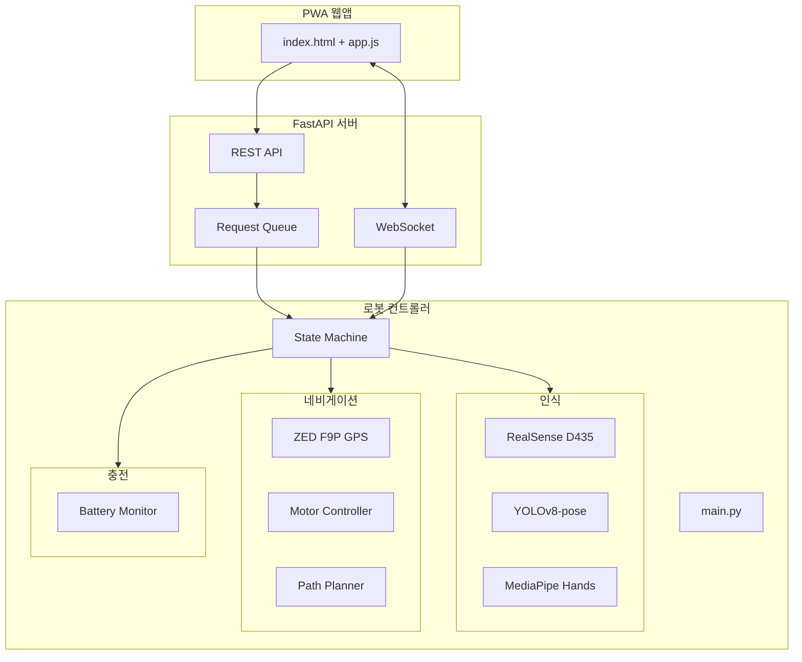

# ChargeMate - 자율주행 이동형 충전 로봇

캠퍼스에서 앱으로 호출하면 대용량 배터리를 싣고 사용자 위치로 찾아와 충전해주는 자율주행 로봇 시스템.

## 주요 기능

- **앱 기반 호출**: PWA 웹앱으로 현재 위치에서 충전 요청
- **자율 주행**: GPS 기반 네비게이션으로 사용자 위치로 이동
- **사용자 인식**: 손 흔들기 감지로 사용자 식별 및 접근
- **충전 관리**: USB-PD 출력 및 충전 상태 모니터링
- **자동 복귀**: 충전 완료 후 홈 위치로 자동 복귀

## 시스템 아키텍처



## 상태 머신 흐름

```
IDLE → DISPATCHING → NAVIGATING → APPROACHING_USER → DOCKING → CHARGING → UNDOCKING → RETURNING → IDLE
       (요청 수락)    (GPS 이동)    (손 흔드는 사람)   (케이블 연결)  (충전 중)   (분리 대기)   (홈 복귀)
```

## 하드웨어 요구사항

| 구성요소 | 모델 | 용도 |
|----------|------|------|
| 카메라 | Intel RealSense D435 | RGB + 깊이 영상 |
| GPS | ZED F9P | RTK 정밀 위치 |
| LiDAR | RPLidar A2 | 장애물 감지 |
| 모터 | H-Mobility 플랫폼 | 이동 |
| 배터리 센서 | INA219 | 전압/전류 모니터링 |

## 설치

### 1. 저장소 클론
```bash
git clone https://github.com/your-org/ChargeMate.git
cd ChargeMate
```

### 2. Python 가상환경 생성
```bash
python -m venv venv
# Windows
venv\Scripts\activate
# Linux/Mac
source venv/bin/activate
```

### 3. 의존성 설치
```bash
pip install -r requirements.txt
```

### 4. YOLOv8 모델 다운로드
```bash
# 자동 다운로드됨 (첫 실행 시)
# 또는 수동 다운로드:
# https://github.com/ultralytics/assets/releases/download/v0.0.0/yolov8n-pose.pt
```

## 설정

`config/settings.yaml` 파일에서 하드웨어 및 동작 설정을 변경합니다:

```yaml
# 주요 설정 항목
robot:
  home_latitude: 37.5665      # 홈 위치 (위도)
  home_longitude: 126.9780    # 홈 위치 (경도)

camera:
  source: "realsense"         # "realsense" | 0 (웹캠) | "video.mp4"

gps:
  enabled: true
  port: "COM4"                # Windows: COMx, Linux: /dev/ttyACMx

motor:
  enabled: true
  port: "COM5"

battery:
  robot_battery:
    sensor_type: "mock"       # "ina219" | "mock"
  output_battery:
    sensor_type: "mock"
```

## 실행

### 풀 시스템 실행 (로봇 + API 서버)
```bash
python main.py
```

### API 서버만 실행 (개발/테스트용)
```bash
python main.py --api-only
```

### GUI 없이 실행 (헤드리스)
```bash
python main.py --no-gui
```

## 웹 앱 사용법

1. 브라우저에서 `http://localhost:8000` 접속
2. "충전 요청하기" 버튼 클릭
3. 이름과 기기 종류 입력
4. 위치 정보 허용
5. 요청 제출 후 로봇 도착 대기
6. 로봇 도착 시 **손을 흔들어** 신호

## API 엔드포인트

| Method | Endpoint | 설명 |
|--------|----------|------|
| GET | `/` | 웹앱 메인 페이지 |
| GET | `/health` | 헬스 체크 |
| POST | `/api/request` | 충전 요청 생성 |
| GET | `/api/request/{id}` | 요청 상세 조회 |
| DELETE | `/api/request/{id}` | 요청 취소 |
| GET | `/api/queue` | 대기열 상태 |
| GET | `/api/robot/status` | 로봇 상태 |
| POST | `/api/robot/emergency-stop` | 비상 정지 |
| WS | `/ws` | 실시간 상태 업데이트 |

## 프로젝트 구조

```
ChargeMate/
├── main.py                    # 메인 진입점
├── config/
│   └── settings.yaml          # 전체 설정
├── perception/                # 인식 모듈
│   ├── realsense_handler.py   # 카메라
│   ├── person_detector.py     # YOLOv8 사람 감지
│   ├── person_tracker.py      # 추적
│   ├── lidar_handler.py       # LiDAR
│   └── sensor_fusion.py       # 센서 융합
├── navigation/                # 네비게이션 모듈
│   ├── gps_handler.py         # GPS
│   ├── motor_controller.py    # 모터 제어
│   └── path_planner.py        # 경로 계획
├── charging/                  # 충전 모듈
│   └── battery_monitor.py     # 배터리 모니터링
├── user_detection/            # 사용자 감지
│   └── hand_detector.py       # 손 흔들기 감지
├── behavior/                  # 행동 제어
│   └── state_machine.py       # 상태 머신
├── communication/             # 통신
│   └── tts_service.py         # TTS 음성 안내
├── app_backend/               # API 서버
│   ├── api.py                 # FastAPI 앱
│   └── models.py              # Pydantic 모델
├── web_app/                   # 웹 프론트엔드
│   ├── index.html             # PWA 메인 페이지
│   └── static/
│       ├── style.css          # 스타일시트
│       └── app.js             # JavaScript
├── utils/
│   └── logger.py              # 로깅 유틸
├── requirements.txt           # Python 의존성
└── README.md                  # 이 파일
```

## 키보드 단축키 (시각화 창)

| 키 | 동작 |
|----|------|
| `q` / `ESC` | 프로그램 종료 |
| `e` | 비상 정지 |

## 문제 해결

### RealSense 카메라 인식 안됨
```bash
# 드라이버 확인
realsense-viewer

# 권한 설정 (Linux)
sudo usermod -aG video $USER
```

### GPS 연결 안됨
```bash
# 포트 확인 (Windows)
# 장치 관리자 > COM 포트 확인

# 포트 확인 (Linux)
ls /dev/ttyACM* /dev/ttyUSB*

# 권한 설정 (Linux)
sudo usermod -aG dialout $USER
```

### YOLO 모델 로드 느림
```bash
# CUDA 설치 확인
python -c "import torch; print(torch.cuda.is_available())"

# CPU로 강제 실행 (느림)
# config/settings.yaml에서:
# detection:
#   device: "cpu"
```

## 라이선스

MIT License

## 기여

이슈 및 PR 환영합니다!
